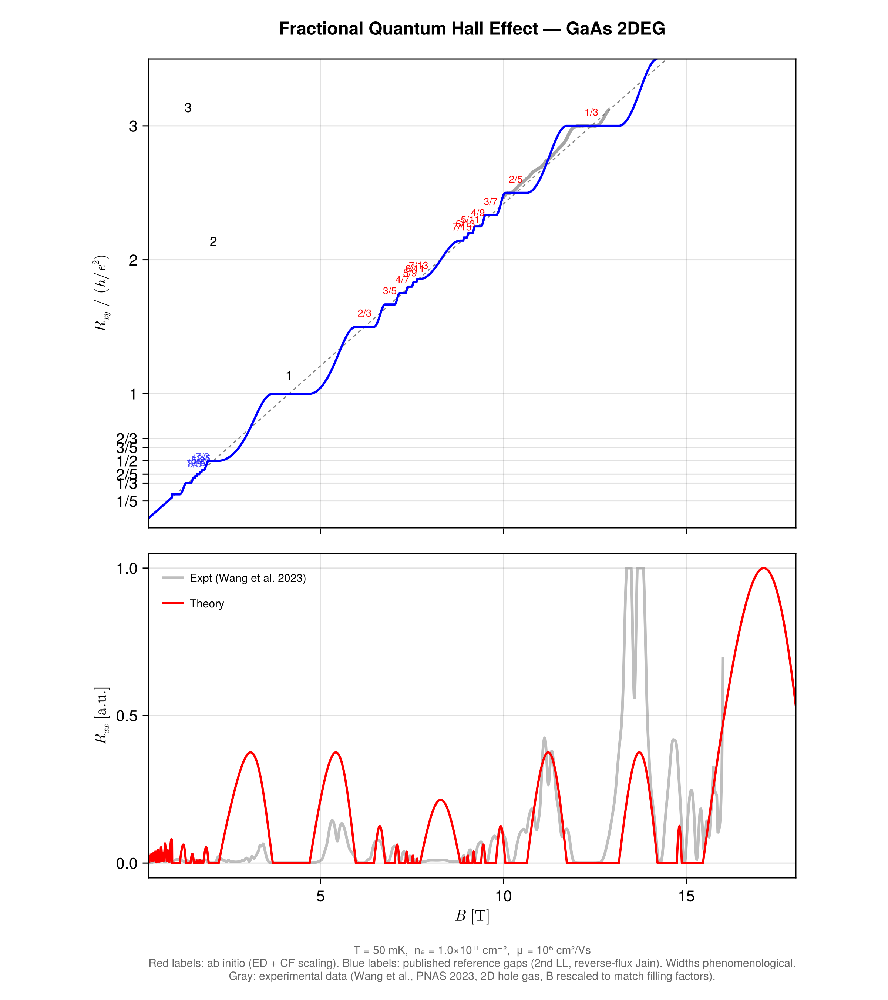

# FQHE.jl

Ab initio simulation of the Fractional Quantum Hall Effect in GaAs, from Haldane pseudopotentials to transport curves.



*Hall resistance (R_xy) and longitudinal resistance (R_xx) for a GaAs 2DEG at T = 50 mK. Fractional plateaux at the Jain principal sequence up to p = 7 (filling factors 1/3, 2/5, 3/7, 4/9, 5/11, 6/13, 7/15 and particle-hole conjugates) are computed from first principles — the 1/3 gap is extracted via exact diagonalization on the Haldane sphere, and higher fractions follow from composite-fermion scaling.*

## Overview

FQHE.jl builds the complete pipeline from microscopic Coulomb interactions to measurable transport signatures:

1. **Haldane sphere geometry** — monopole harmonics, angular momentum coupling via Clebsch-Gordan coefficients
2. **Pseudopotentials** — Coulomb interaction projected into the lowest Landau level
3. **Exact diagonalization** — sparse Hamiltonian in the Fock basis, Lanczos solver for ground state and excitation gaps
4. **Composite fermion theory** — geometric gap scaling for the Jain sequence: $\Delta(\nu = p/(2p+1)) = \Delta(1/3) \times r^{p-1}$
5. **Transport model** — thermally activated $R_{xx}$ and quantized $R_{xy}$ plateaux with neighbor-aware width capping

## Quick start

```bash
# Clone and instantiate
git clone <repo-url> && cd FQHE
julia --project=. -e 'using Pkg; Pkg.instantiate()'

# Validate ED against Fano et al. (1986) — should give gap ~ 0.082:
julia --project=. -e '
using FQHE
twoS = sphere_flux(6, 1//3)
VJ = coulomb_pseudopotentials(twoS)
basis = enumerate_fock_states(6, twoS; twoLz=0)
E0, gap = neutral_gap(basis, VJ)
println("N=6 ν=1/3 neutral gap: $gap")
'

# Generate the plot (~5s after JIT):
julia --project=. scripts/04_make_plot.jl
# → fqhe_plot.pdf, fqhe_plot.png
```

## Project structure

```
src/
  FQHE.jl                 # Module entry point
  materials.jl             # GaAs parameters (m*, g, ε)
  landau.jl                # Landau levels, magnetic length, cyclotron energy
  sphere.jl                # Haldane sphere: flux-particle relation
  monopole_harmonics.jl    # Single-particle orbitals on the sphere
  hilbert_space.jl         # Many-body Fock space enumeration
  pseudopotentials.jl      # Coulomb Haldane pseudopotentials
  hamiltonian.jl           # Sparse Hamiltonian construction
  exact_diag.jl            # Lanczos ED: ground state, neutral & charge gaps
  composite_fermion.jl     # CF gap scaling for Jain sequence
  laughlin.jl              # Laughlin wavefunction overlaps
  integer_qhe.jl           # Integer QHE (analytic)
  transport.jl             # R_xx, R_xy from gaps and temperature

scripts/
  01_fetch_sources.jl      # Literature acquisition
  02_compute_gaps.jl       # Full gap pipeline (charge + neutral)
  03_build_transport.jl    # Transport curve generation
  04_make_plot.jl          # Final plot with ED + CF gaps

proof/                     # Formal verification artifacts
test/                      # Unit tests
```

## Key results

| Quantity | This code | Published | Reference |
|----------|-----------|-----------|-----------|
| Neutral gap, $\nu=1/3$, $N=6$ | 0.0820 $e^2/\epsilon\ell$ | 0.0822 | Fano et al. (1986) |
| Charge gap, $\nu=1/3$, $N\to\infty$ | 0.075 $e^2/\epsilon\ell$ | 0.1036 | Morf & Halperin (1986) |

The charge gap extrapolation undershoots due to linear $1/N$ fitting with only $N = 3$-$6$ data points; quadratic correction requires $N \geq 8$, currently limited by the CG coefficient bottleneck.

## Requirements

- Julia 1.10+ (tested with 1.12)
- Dependencies installed automatically via `Project.toml`: Arpack, CairoMakie, Combinatorics, KrylovKit, WignerSymbols

## License

GNU General Public License v3.0 — see [LICENSE](LICENSE).
